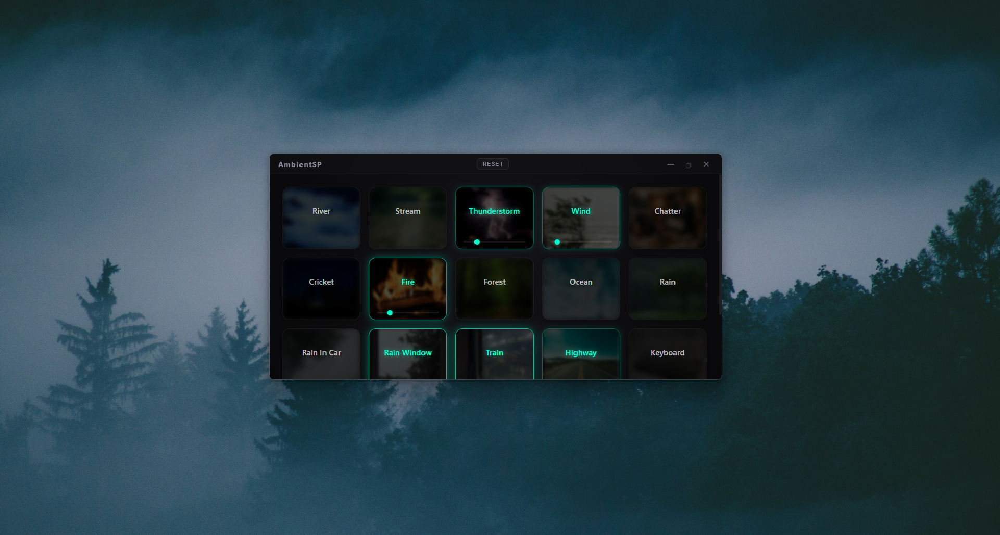
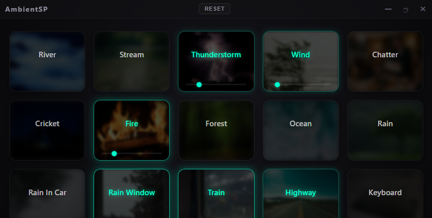

<p align="center">
  
</p>

<p align="center">
  
  
  
  
</p>

---

<p align="center">
  <strong>AmbientSP (Ambient Sound Player)</strong> is ambient sound player that can play on background. Made for you to relax.
</p>

<p align="center">
  <a href="#key-features">Key Features</a> •
  <a href="#how-it-looks">How It Looks</a> •
  <a href="#available-sounds">Available Sounds</a> •
  <a href="#installation">Installation</a> •
  <a href="#building-from-source">Building</a>
</p>

---

## ⚡ Key Features

*   **🎛️ Multi-Channel Audio Mixer:** Play as many sounds as you want simultaneously. Tweak individual volumes on every sound.
*   **💾 Auto-Save State:** The app automatically remembers your active sound combination and volume levels when you close it, restoring them on the next launch.
*   **📥 System Tray Integration:** Fully hide the app into the Windows system tray (`Ctrl + R` is not needed). It runs quietly in the background without messing in your taskbar.
*   **🚀 Run on Startup:** Easily toggle the "Launch at Startup" option directly from the system tray context menu (works for both Installer and Portable versions).
*   **🧼 Clean Minimalist UI:** Custom frameless window design with custom window controls [Minimize, Hide to Tray, Close] and a dedicated **Reset** button to mute all active sounds in one click.

---

## 📸 How It Looks

### Desktop Preview
<p align="center">
  
</p>

### Compact Interface & Active Sound Mixer
<p align="center">
  
</p>

---

## 🎵 Available Sounds

The player comes pre-configured with **18 premium atmospheric tracks**:

| Category | Soundscapes |
| :--- | :--- |
| **Water** | 🌊 Ocean • 🌧️ Rain • 💧 River • 🌊 Stream • 🚗 Rain In Car • 🪟 Rain Window |
| **Nature** | ⛈️ Thunderstorm • 💨 Wind • 🌲 Forest • 🦗 Cricket |
| **Urban** | 🗣️ Chatter • 🚂 Train • 🛣️ Highway • ⌨️ Keyboard |
| **Acoustic Noise** | ⬜ White Noise • 🟫 Brown Noise • 🪶 Pink Noise |

---

## 🛠️ Installation

To run the application locally from source, you need [Node.js](https://nodejs.org/) installed on your machine.

1. **Clone the repository:**
   ```bash
   git clone https://github.com/yourusername/AmbientSP.git
   cd AmbientSP
   ```

2. **Install dependencies:**
   ```bash
   npm install
   ```

3. **Start the application:**
   ```bash
   npm start
   ```

---

## 📦 Building from Source

To compile and package the application into a standalone Windows installer or a standalone portable `.exe` file:

```bash
npm run build
```

The compiled binaries will be generated inside the `/dist` or `/out` directory.

---

## 📄 License

This project is licensed under the GPLv2 License - see the [LICENSE.md](LICENSE.md) file for details.

-# *Made by ewasion137. Yes it's vibecoded, i don't care tbh.*
